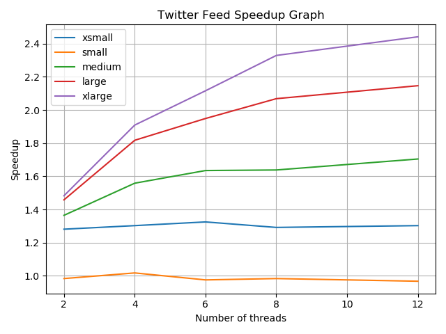

# Project: Twitter Feed (Modeled as a Bounded-Buffer Problem)

### Project Description - 

This project is an implementation of a twitter feed (modeled as a linked list), where tasks are handled using a lock free queue and in the producer-consumer setting. The producer-consumer setting is where a producer puts tasks into a channel and the consumer takes tasks from the channel. The consumer handles the processing of each task by knowing the state of the twitter feed when it dequeues a task. We will go into the specifics of each component in the next section.

### Important System Components - 

1. Twitter Feed (`feed.go`) - This is modeled as a linked list where the **nodes represent posts**. The types of tasks that can be handled by the feed are as follows:

    - `ADD` - adds a post to the twitter feed.
    - `REMOVE` - removes a post from the twitter feed.
    - `CONTAINS` - check whether a post is contained within a the twitter feed.
    - `FEED` - display the entire twitter feed.

    The feed **maintains an orderering based on the timestamp** such that the most recent timestamp is at the beginning, followed by the second most recent timestamp, and so on.

    A post is made up of the following attributes - 

    - `body` - refers to the contents of the tweet.
    - `timestamp` - refers to the time at which the tweet was "tweeted" i.e. when it was made.
    - `next` - a pointer to the next node i.e. post in the feed.

    The feed is locked and unlocked using a **course-grained** implementation of a linked-list. This means that the entire feed is locked during the completion of any of the operations mentioned above. 

    The locking is carried out using a **read-write lock**. Each operation i.e. read and write are carried out with a respective **counting semaphore**. When locking and unlocking during the read operation, a read semaphore is locked and unlocked respectively. When locking and unlocking during the write operation, we perform the same task of locking and unlocking using the write sempahore for the respective functions, however, we also need to prevent any reads from taking place as the write operation may change what a reader should read at a node. Therefore, we also lock each reader (in the lock function) and unlock each reader (in the unlock function). We know the number of readers possible as this is a hard-coded limit of **32**. This means that there can be 32 concurrent read operations however, only 1 write operations (without any reader operations happening concurrently).

2. Server (`server.go`) - The server can be ran in two modes i.e `s` for sequential and `p` for parallel. We will how to run the application in the next sub-section.
    
    - The sequential mode processes tasks serially. The tasks are provided using file redirection to `stdin` and are in the `JSON` format. The result is pushed to `stdout` in the same `JSON` format with the `id` of the task, the result of the task i.e. `success` and the desired output (in the case of the `FEED` function). 
    - The same form of I/O takes place in the parallel mode. However, tasks are completed in parallel. This is accomplished by using a **lock-free queue**. A lock-free queue is a queue implementing concurrency without actually performing any locking and unlocking operation. The enables the queue to be accessed quickly, does **NOT** result in deadlock and allows reentry. Tasks are added to the queue by the producer (which is the main thread) and consumers process each task from the queue. Each consumer is a thread and there a **n** consumers spawned (based on the specification by the user). The producer continues adding tasks to the queue until it receives the `DONE` command, at which point, it broadcasts this to all consumers. Whenever the producers adds a task to the queue, it signals a consumer to complete the task (if any are waiting). The consumer processes tasks until told by the producer that the `DONE` command has been seen, at which point it returns. Until seeing this command, the consumers complete tasks while there are tasks in the queue. If there are no tasks in the queue, the consumers wait until told by the producer that there is a task in the queue. This waiting is carried out in a **non-blocking** manner.

3. Twitter Application (`twitter.go`) - This is the twitter client program and enables the user to run the program in two modes:
    - `s` - sequential task execution mode.
    - `p` - parallel task execution mode. In this mode, the number of threads (i.e. the number of consumers) must be provided by the user.

    The I/O for the client takes places in the same manner as described above i.e. tasks are provided using file redirection to `stdin` and are in the `JSON` format. The result is pushed to `stdout` in the same `JSON` format with the `id` of the task, the result of the task i.e. `success` and the desired output (in the case of the `FEED` function). 

### Running the Program - 

The twitter client can be run in the following way - 

```console
foo@bar:~$ go run path/to/twitter.go <number of consumers> < path/to/tasks.txt
```

where `tasks.txt` contains a task in the `JSON` format at each line.

If the user does not specify the number of consumers, the program runs in sequential mode and if the user does specify the number of consumers, the program runs in parallel mode where one thread is spawned for **each** consumer.

### Testing the Program - 

The program can be tested using the following command - 

```console
foo@bar:~$ sbatch benchmark-proj1.sh
```

This must be run within the `grader directory`. Make sure to create the `slurm/out` directory inside `grader` directory and check the `.stdout` file for the outputs for passing all test cases and the timings. 

### Benchmarking the Program - 

Benchmarking is done by using the `benchmark/benchmark.go`. To benchmark the application, use the following command when within the `benchmark` directory - 

```console
foo@bar:~$ sbatch benchmark.sh
```

Make sure to create the `slurm/out` directory inside `benchmark` directory and check the `.stdout` file for the output timings for benchmarking. The problems sizes are as follows - xsmall, small, medium, large, xlarge. This is done over a sequential run, and using 2, 4, 6, 8, and 12 threads to compute speedups. The speedups for each thread case for each problem size is then plotted and this is the resulting graph - 




The graph will be created within the `benchmark` directory. The computation of the speedups along with the storing of each of the benchmarking timings and the plotting of the stored data happens by using `benchmark_graph.py` which is called from within `benchmark.sh` (both reside in the `benchmark` directory).


The following observations can be made from the graph - 

1. The increased flattening of the speedup curves (as the number of threads spawned increases) for each problem size indicates the growing overhead cost of spawning threads. This means that either there is more time being taken up in the critical section (i.e. when tasks are dequeued by consumers which are threads) or that we are no longer able to amortize the cost of spawning and maintaining threads with respect to the problem size. 

2. We see greater speedups as we increase the problem size meaning that we are still able to amortize the cost of spawning and maintaining threads (though this reduces further as the lines flatten as we increase the number of threads). 

3. For the xsmall and small problem sizes, we see a negative slope on at some points in the curve. This is because the cost of spawning and maintaining threads is greater than the speedup gained from parallelization.


### Questions About Implementation - 

1. What affect does the linked-list implementation have on performance? Does changing the implementation to lock-free or lazy-list algorithm size improve performance?

    An alternative to using a linked-list would be to use a hash table. If we use this, then we can speed up the runtime of the `ADD`, `REMOVE` and `CONTAINS` operations to constant time i.e. O(1) instead of the current linear time i.e. O(N). However, the `FEED` operation would remain linear. To maintain the order of posts, each element of the hash table could contain a pointer to the next and previous elements in the feed (and in the hash table).

    Making the linked-list lock free would improve the runtime performance, however, would increase the space requirements as we would be required to pass an instance of the feed to each consumer. When there is high contention for the concurrent data structure, it would increase performance to use a lock-free implementation.

    A lazy-list algorithm would not perform faster than the current implementation.

2. Based on the topics we discussed in class, identify the areas in your implementation that could hypothetically see increases in performance if you were to use a different synchronization technique or improved queuing techniques. Specifically, look at the RW lock, queue, and producer/consumer components and how they all might be affecting performance. Explain why you would see potential improvements in performance based on either keeping these components are substituting them out for better algorithms.

    Increasing the number of producers would increase the performance of the program, however, this is dependent on parallelizable read operations for the input tasks to enqueue. This is because if we are able to read tasks in parallel, we will be able to add them to the task queue in parallel, by spawning multiple producers (1 thread for each).

    Using a fine-grained locking mechanism instead of the RW lock for a course-grained implementation of the linked-list could result in an improvement in performance if there is a lot of contention for the data structure. This is because, the entire data structure is locked in the course-grained implementation of the linked-list forcing threads to wait. If there is a lot of contention for the data structure, the causes a decrease in performance. We would see an increase in performance if only certain nodes were locked as it would allow multiple readers and writers at the same time. This in turn would amortize the cost of spawning more threads and thereby result in greater speedups as well.

3. The hardware **does** have an effect on the performance of the benchmarks. A faster system bus can result in an improvement in performance as it would enable faster reads and writes from and to main memory. In addition, distributing the data structure across different memory nodes could alleviate contention on a single bus however this is more of an implementation improvement. In addition, faster processor that are physically closer together (and to main memory) would help to amortize the cost of spawning more threads due to the reduction in latency between reads and writes to main memory, thus resulting in an improvement in speedups and overall performance of the program.
